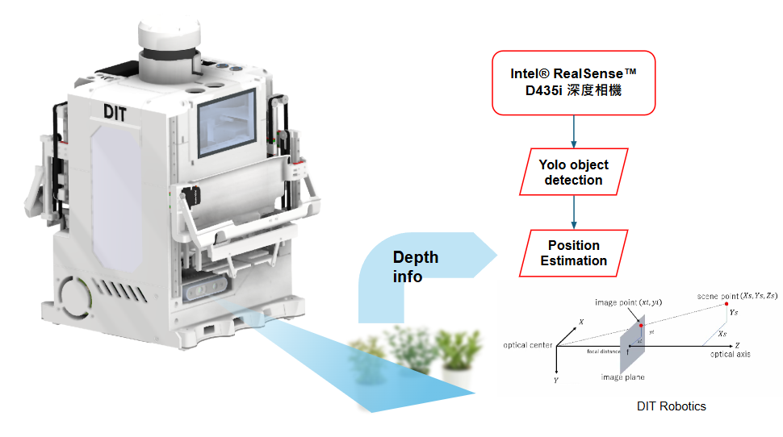
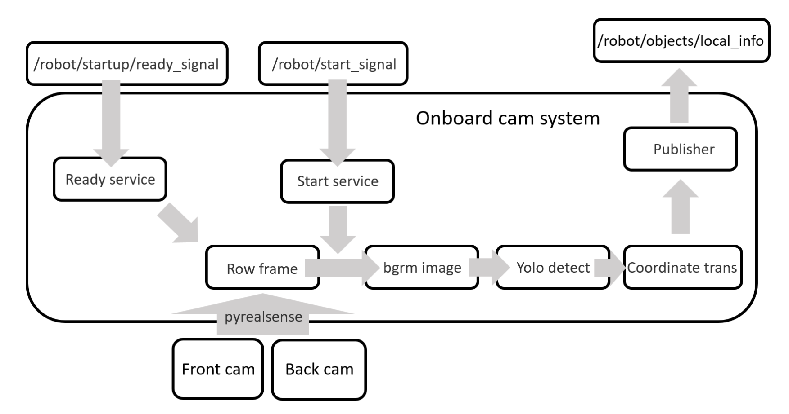

# DIT Eurobot2024 onboard-camera development historical repository 

## Onboard Plant Visual System

### System Abstract

This system means to provide position informations of the mission object plants to the main robot system in order to to support plant picking.

The following gragh shows a more detailed look of the system ROS construction, including receiving start and ready signals from the main robot system, collecting camera informations and sending pose informations back to the robot.

Mainly based on yolov8, worked along with realsense D435i depth camera, the system was trained with self-prepared dataset annotated on roboflow.

